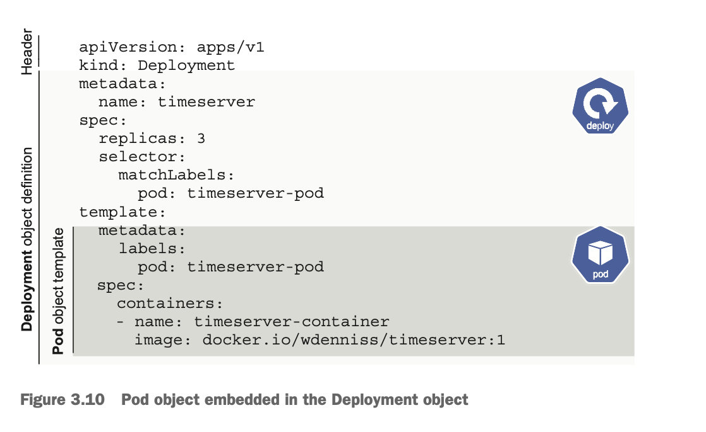
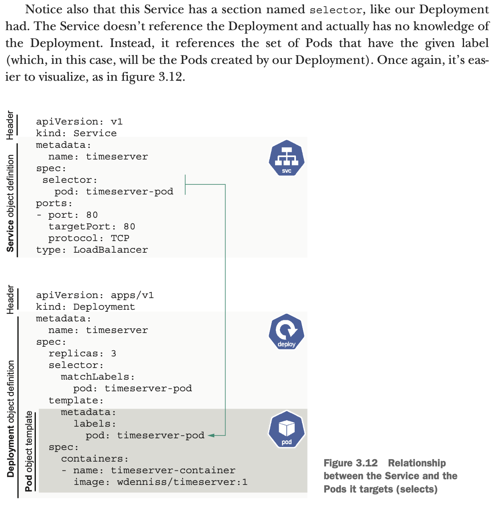

### deployment



- Pod object embedded in the Deployment object. \
  When you create a Deployment of three replicas, in actuality, you are instructing the Kubernetes Deployment controller to create and manage three Pods. The Deploy- ment controller manages the lifecycle of these pods, including replacing them with newer versions when you update the Deployment with a new container and reschedul- ing Pods that get evicted due to planned or unplanned maintenance events. Figure 3.10 has a visual breakdown of this object composition.

---

### service



- If you specify type: LoadBalancer as in the previous example, an external IP address will be provisioned in addition.
- Notice also that this Service has a section named selector, like our Deployment had. The Service doesn’t reference the Deployment and actually has no knowledge of the Deployment. Instead, it references the set of Pods that have the given label (which, in this case, will be the Pods created by our Deployment). Once again, it’s eas- ier to visualize, as in figure 3.12.
- create your service \
  `kubectl create -f service.yaml` \
  Notice how the creation command (kubectl create) is the same for the Deploy- ment as the Service. All Kubernetes objects can be created, read, updated, and deleted (so-called CRUD operations) with four kubectl commands: \
  ```sh
  kubectl create
  kubectl get
  kubectl apply
  kubectl delete
  ```

### exec in pod

- Technically, exec is run against a Pod, but we can specify the Deployment instead of a specific Pod, and kubectl will select one Pod at random to run the command on: \

  ```sh
  $ kubectl exec -it deploy/timeserver -- sh # on deployment

  # below 2 ways are same
       $ kubectl exec -it icn13824-application-6797779d85-xng2x --container puma --namespace icn -- /bin/sh  # on pod
       $ kubectl exec -it deploy/icn13824-application --container puma --namespace icn -- /bin/sh  # on deployment, better -- no need to know pods run time id

  ```
